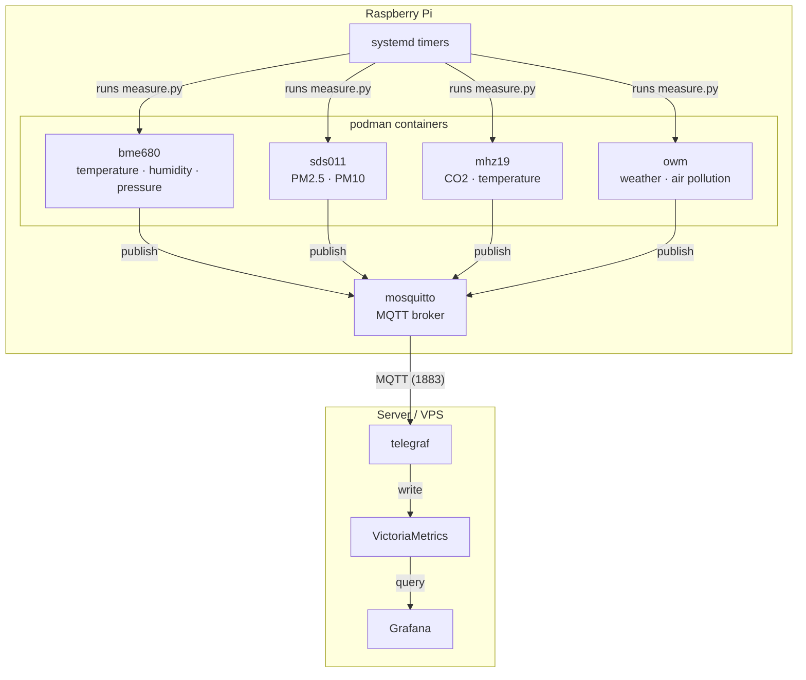

# AirQ

Air quality monitoring system running on a Raspberry Pi. Sensor readings are published over MQTT and stored in VictoriaMetrics for visualization in Grafana.

## Architecture

Two independent stacks communicate over the network:

**Raspberry Pi** (`rpi/`) collects data:
- One container per sensor, all built from a single image
- Mosquitto as the local MQTT broker
- systemd timers trigger each sensor container via quadlets

**Server** (`server/`) stores and visualizes data:
- Telegraf subscribes to the Pi's MQTT broker and writes to VictoriaMetrics
- VictoriaMetrics stores time-series data
- Grafana serves the dashboards

```
Sensors → measure.py (systemd timer) → MQTT → Telegraf → VictoriaMetrics → Grafana
```



## Sensors

| Name | Measures | Interface | Schedule |
|------|----------|-----------|----------|
| BME680 | Temperature, humidity, pressure | I2C (`/dev/i2c-1`) | every 1 min |
| SDS011 | PM2.5, PM10 | USB serial (`/dev/ttyUSB0`) | every 10 min |
| MH-Z19C | CO2, temperature | UART (`/dev/ttyS0`, GPIO 14/15) | every 1 min |
| OWM | Weather + air pollution (via API) | OpenWeatherMap API | every 5 min |

The MH-Z19C requires the serial console on `/dev/ttyS0` to be disabled. On Raspbian: `raspi-config` → Interface Options → Serial Port → disable login shell, keep hardware enabled.

## Requirements

- Raspberry Pi (3B or newer) running Podman with rootless mode enabled
- Server or VPS running Docker or Podman
- OpenWeatherMap API key

## Setup

**1. Create the environment file:**

```bash
make init-dotenv
```

This writes `.env` in the repo root and copies it to `~/.airq/config.env` (read by the quadlets) and `~/.airq/mosquitto.conf`.

Alternatively, copy and edit manually:

```bash
cp .env.example .env
mkdir -p ~/.airq
cp .env ~/.airq/config.env
cp rpi/mosquitto/mosquitto.conf ~/.airq/mosquitto.conf
```

**2. On the Raspberry Pi — install and start the sensor stack:**

```bash
make install-rpi     # install quadlets and timers into systemd
make up-rpi          # enable and start mosquitto + all sensor timers
```

To rebuild the sensor image after code changes:

```bash
podman build -t airq-sensor:latest rpi/
```

**3. On the server — start the storage and visualization stack:**

```bash
make up-server
```

**4. Configure Grafana:**

Open `http://<server>:3000` and add VictoriaMetrics as a data source (type: Prometheus, URL: `http://victoria-metrics:8428`).

## Environment Variables

| Variable | Used by | Default | Description |
|----------|---------|---------|-------------|
| `TZ` | both | `UTC` | Timezone for timestamps |
| `MQTT_HOST` | rpi | `mosquitto` | MQTT broker hostname (within the container network) |
| `MQTT_PORT` | rpi | `1883` | MQTT broker port |
| `OWM_API_KEY` | rpi | — | OpenWeatherMap API key (required) |
| `LATITUDE` | rpi | — | Location latitude |
| `LONGITUDE` | rpi | — | Location longitude |
| `MQTT_BROKER` | server | — | Pi's IP or hostname (used by Telegraf) |
| `GRAFANA_USER` | server | `admin` | Grafana admin username |
| `GRAFANA_PASSWORD` | server | — | Grafana admin password |
| `SDS011_PORT` | rpi | `/dev/ttyUSB0` | SDS011 serial device |
| `WARM_UP_TIME` | rpi | `15` | SDS011 warm-up seconds |
| `COLLECT_TIME` | rpi | `15` | SDS011 collection window seconds |
| `MHZ19_PORT` | rpi | `/dev/ttyS0` | MH-Z19C serial device |

## Development

```bash
# Trigger a measurement manually
podman exec bme680 python /app/measure.py
podman exec mhz19 python /app/measure.py

# Watch live MQTT output
podman exec mosquitto mosquitto_sub -t 'sensors/#' -v

# Run linting and pre-commit checks
pre-commit run --all-files
```

## Project Structure

```
rpi/
  Dockerfile          # multi-stage build (python:3.12 builder, python:3.12-slim runtime)
  requirements.txt
  measure.py          # entrypoint — reads SENSOR_TYPE, calls sensor.publish()
  sensor/
    base.py           # abstract Sensor class
    bme680.py
    sds011.py
    mhz19.py
    owm.py
  mosquitto/
    mosquitto.conf
  quadlets/           # systemd quadlet units (.container, .network, .volume) and timers
server/
  compose.yml
  telegraf/
    telegraf.conf
```
